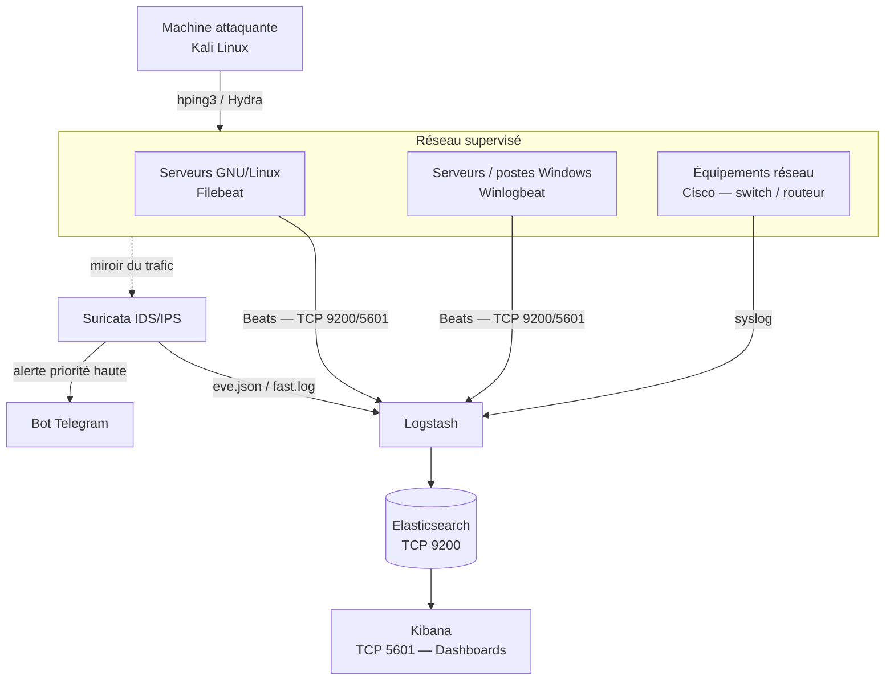

# SIEM
Mise en place d'un SIEM
# 🛰️ SIEM — ELK Stack + Suricata

Solution de supervision réseau et de détection de comportements anormaux (SIEM), combinant la **suite ELK** (Elasticsearch, Logstash, Kibana) pour la centralisation/visualisation des logs et **Suricata** (IDS/IPS) pour l'inspection du trafic réseau et la génération d'alertes, avec une notification en temps réel via un **bot Telegram**.

---

## 📋 Sommaire

- [Architecture](#-architecture)
- [Stack technique](#-stack-technique)
- [Environnement de test](#-environnement-de-test)
- [Installation et configuration](#-installation-et-configuration)
- [Règles de détection Suricata](#-règles-de-détection-suricata)
- [Attaques simulées](#-attaques-simulées)
- [Résultats](#-résultats)
- [Liens utiles](#-liens-utiles)

---

## 🏗️ Architecture



- **Suricata** inspecte le trafic réseau en profondeur (IP, DNS, HTTP, TLS…) et déclenche des alertes lorsqu'un paquet correspond à une règle définie.
- **Filebeat / Winlogbeat** collectent respectivement les logs des serveurs Linux et les journaux d'événements Windows (connexions, échecs d'authentification, comptes bloqués…) et les transmettent via le protocole *Beats*.
- **Logstash** centralise, filtre et transforme les logs avant de les envoyer à Elasticsearch.
- **Elasticsearch** indexe et stocke les données pour une recherche en temps réel.
- **Kibana** restitue les données sous forme de tableaux de bord interactifs (dashboards *Winlogbeat Security*, alertes Suricata, etc.).
- Un **bot Telegram** relaie les alertes de priorité haute détectées par Suricata, pour une notification en temps réel des administrateurs.

## 🧰 Stack technique

| Composant | Rôle |
|---|---|
| **Elasticsearch** | Moteur de recherche/indexation — stockage et analyse des logs |
| **Logstash** | Collecte, filtrage et transformation des logs vers Elasticsearch |
| **Kibana** | Visualisation — tableaux de bord interactifs |
| **Suricata** | IDS/IPS — analyse du trafic réseau en profondeur et génération d'alertes |
| **Winlogbeat** | Agent de collecte des journaux d'événements Windows |
| **Filebeat** | Agent de collecte des logs sur serveurs GNU/Linux |
| **Telegram Bot API** | Canal de notification en temps réel des alertes |
| **VMware** | Virtualisation des machines du laboratoire |
| **hping3** | Test — attaque par déni de service (DoS) |
| **Hydra** | Test — attaque par force brute (SSH) |

## 🖥️ Environnement de test

| Machine | Rôle |
|---|---|
| **Serveur Ubuntu** | Héberge le SIEM (ELK Stack + Suricata) et centralise les logs |
| **Client Windows** | Machine cible supervisée via Winlogbeat |
| **Machine Kali Linux** | Machine attaquante (tests hping3 / Hydra) |

## ⚙️ Installation et configuration

### 1. Elasticsearch + Kibana (serveur Ubuntu)

> ℹ️ Le document source installait Elastic Stack 8.x. La branche majeure actuellement recommandée par Elastic est la **9.x** — la procédure ci-dessous est mise à jour en conséquence (adapter `9.x` en `8.x` si une compatibilité spécifique est requise).

```bash
# Mise à jour du système
apt update && apt upgrade -y

# Clé GPG et dépôt Elastic (branche 9.x)
curl -fsSL https://artifacts.elastic.co/GPG-KEY-elasticsearch | \
  gpg --dearmor | sudo tee /usr/share/keyrings/elasticsearch-keyring.gpg > /dev/null
echo "deb [signed-by=/usr/share/keyrings/elasticsearch-keyring.gpg] https://artifacts.elastic.co/packages/9.x/apt stable main" | \
  sudo tee /etc/apt/sources.list.d/elastic-9.x.list

# Installation
apt update && apt-get install elasticsearch
apt update && apt-get install kibana
```

Configuration de l'interface d'écoute d'Elasticsearch (`/etc/elasticsearch/elasticsearch.yml`) :
```yaml
network.host: 0.0.0.0
```

Démarrage des services :
```bash
systemctl start elasticsearch.service
systemctl start kibana.service
```

Kibana est alors accessible via une connexion sécurisée sur `https://<IP_DU_SERVEUR>:5601`.

### 2. Suricata (IDS/IPS)

> ℹ️ Depuis 2024, l'installation via PPA nécessite explicitement le paquet `software-properties-common` avant l'ajout du dépôt.

```bash
sudo apt-get install software-properties-common
sudo add-apt-repository ppa:oisf/suricata-stable
sudo apt update
sudo apt install suricata -y
```

Vérification de l'installation :
```bash
suricata --build-info
```

Fichiers de configuration :

| Élément | Chemin |
|---|---|
| Configuration principale | `/etc/suricata/suricata.yaml` |
| Règles IDS/IPS | `/etc/suricata/rules/` |
| Logs (alertes) | `/var/log/suricata/` (`fast.log`, `eve.json`) |

### 3. Winlogbeat (postes Windows)

1. Télécharger l'agent depuis le site officiel Elastic : `elastic.co/downloads/beats/winlogbeat`.
2. Éditer `winlogbeat.yml` avec l'adresse du serveur Kibana/Elasticsearch, par exemple :

```yaml
setup.kibana:
  host: "https://<IP_DU_SERVEUR>:5601"
  ssl.verification_mode: none
  username: "elastic"
  password: "<mot_de_passe>"

output.elasticsearch:
  hosts: ["<IP_DU_SERVEUR>:9200"]
  protocol: "https"
  ssl.verification_mode: none
  username: "elastic"
  password: "<mot_de_passe>"
```

3. Démarrer le service :
```powershell
Start-Service winlogbeat
```

Winlogbeat permet de surveiller : l'activité de connexion des utilisateurs, les tentatives de connexion infructueuses, les comptes bloqués, etc.

### 4. Notification Telegram

Les alertes Suricata de priorité haute sont relayées vers un bot Telegram, offrant une notification en temps réel (type d'attaque, horodatage, IP source/destination) en complément du dashboard Kibana. *(Le script d'intégration exact — lecture de `fast.log`/`eve.json` et appel à l'API Telegram Bot — n'est pas détaillé dans le document source ; à documenter/ajouter dans un dossier `scripts/` si disponible.)*

## 🛡️ Règles de détection Suricata

Détection d'une attaque de type **DDoS** :
```
alert ip any any -> $HOME_NET any (msg:"Possible DDoS Attack Detected"; threshold: type threshold, track by_dst, count 100, seconds 10; sid:1000005;)
```

Détection d'une attaque **SSH Brute Force** :
```
alert tcp any any -> $HOME_NET 22 (msg:"SSH brute force attempt"; flags:S; threshold: type threshold, track by_src, count 5, seconds 60; sid:1000003; rev:1;)
```

## 🧪 Attaques simulées

| # | Attaque | Commande / outil | Comportement attendu du SIEM |
|---|---|---|---|
| 1 | Déni de service (DoS) | `hping3 -c 10000 -d 120 -S -w 64 -p 21 --flood --rand-source <IP_cible>` | Détection + journalisation dans `fast.log` + alerte Telegram |
| 2 | Force brute SSH | `hydra -L rockyou.txt -P rockyou.txt <IP_cible> ssh -t 4` | Détection + journalisation + alerte Telegram |
| 3 | Authentification illégitime (Windows) | Connexion avec mot de passe volontairement erroné | Remontée dans le dashboard *Winlogbeat Security* (`event.action` → *logon-failed*) |

## 📊 Résultats

- Les attaques DoS et SSH brute force ont été **détectées avec précision** (date/heure) et journalisées en temps réel dans `/var/log/suricata/fast.log`, avec IP source, IP/port de destination et niveau de priorité.
- Chaque alerte de priorité haute a été relayée automatiquement sur le bot Telegram, dans un format lisible (type d'attaque, horodatage, IP).
- Le dashboard **Winlogbeat Security** dans Kibana centralise les tentatives de connexion échouées (compteur *Failed Logon*, table détaillée avec `user.name`, `source.ip`, `event.action`, horodatage).

## 🔗 Liens utiles

- Documentation Suricata : https://docs.suricata.io
- Téléchargement Winlogbeat : https://www.elastic.co/downloads/beats/winlogbeat
- Dépôt Elastic (apt) : https://www.elastic.co/guide/en/elasticsearch/reference/current/deb.html
